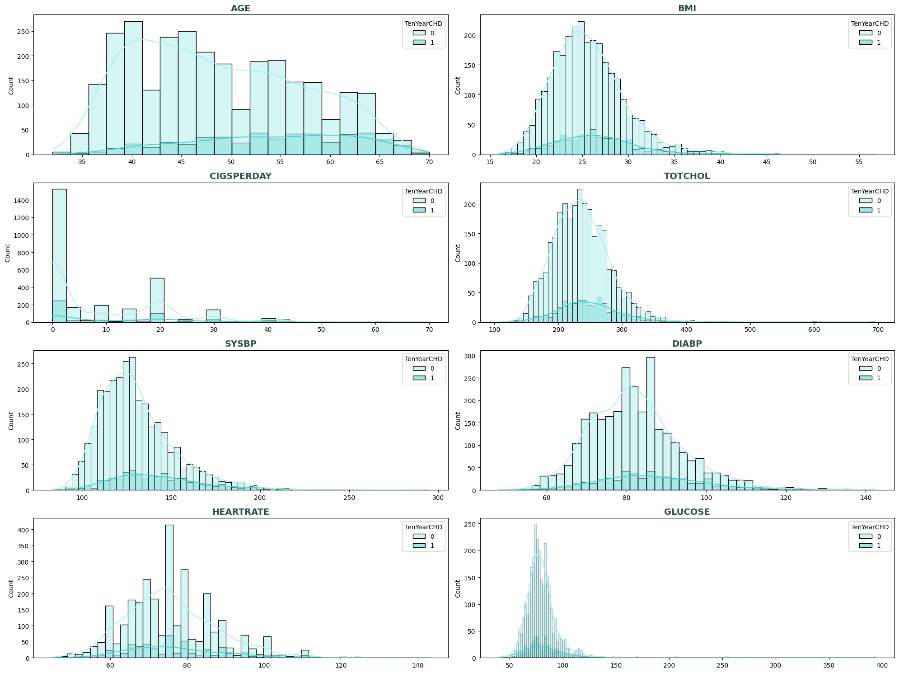
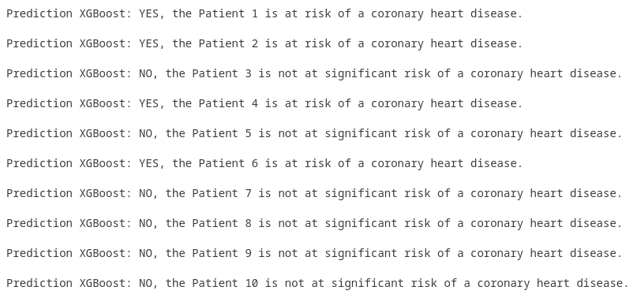
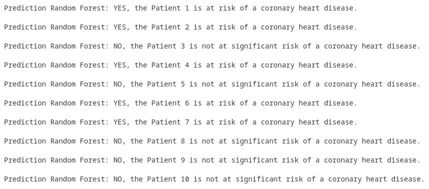

# CARDIOVASCULAR RISK PREDICTION

-----------------------

    
    

 

## MOTIVATION

This project aims to predict, using machine learning algorithms, the likelihood of a patient having coronary heart disease.

## DESCRIPCIÓN

The chosen dataset for this project is the Cardiovascular_risk_data from Kaggle, available [here](https://www.kaggle.com/datasets/mamta1999/cardiovascular-risk-data).

This dataset includes medical and socio-demographic information such as blood pressure, cholesterol levels, diabetes, age, education level and others. The aim is to use these variables to predict whether or not the enrolled patient is at risk of coronary heart disease.

A comprehensive analysis of the dataset was carried out, together with data cleaning. Presented below are some visualizations generated during the data analysis process.

    
    

 

The data has been preprocessed to create predictions, using techniques such as scaling, encoding and resampling.

To generate the predictions, we utilised various machine learning algorithms such as

- Logistic Regression,

- Decision Tree

- Random Forest

- XGBoost.

Ultimately, the Random Forest and XGBoost algorithms produced the most accurate and optimal results. An example of the risk prediction outcomes for ten upcoming patients using two algorithms is presented. The results obtained from both methodologies are identical in nine out of ten cases.

    
    

 

To facilitate a better visualization and understanding of the data, this project has been complemented with a Tableau visualization as found at the beginning of this file.

## STRUCTURE

This repository is structured into the following folders and files:

***FOLDERS***

- **data:** contains subfolders with different data files:

        - original_data: Original dataset used for the project and its description.

        - generated_data: Different datasets created during the project with modified data.

        - predict_objects: Pickle artifacts generated during the project to apply to new data in predictions.

        - data_for_visualization: Dataset with some modifications to make data visualization friendlier and to be used in the dashboard.

- **images:** contains subfolders with different types of images:

        - analysis_and_exploration: Graphs generated during data exploration.

        - confusion_matrix: Confusion matrices generated in the Logistic Regression model.

        - feature_importance_by_model: Graphs with the importance of predictor variables generated in different models.

        - predictions:  Examples of predictions.

        - dashboard: Images of the dashboard.

- **src:** contains the Python files used in the project.

***FILES***

- **Jupyter files:** Numerically ordered files with the development of the process.
- **'Analysis and conclusions' file:** Markdown file with a summary of the data analysis and conclusions drawn from the project.
- **'Readme' file:** This file.

## LIBRARIES USED

For this project, the following libraries have been imported:

- **Numpy:** to access the official documentation, click [here](https://numpy.org/doc/stable/user/).
- **Pandas:** to access the official documentation, click [here](https://pandas.pydata.org/docs/).
- **Matplotlib:** to access the official documentation, click [here](https://matplotlib.org/stable/users/index.html).
- **Seaborn:** to access the official documentation, click [here](https://seaborn.pydata.org/tutorial.html).
- **Researchpy:** to access the official documentation, click [here](https://researchpy.readthedocs.io/en/latest/).
- **Itertools:** to access the official documentation, click [here](https://docs.python.org/es/dev/library/itertools.html).
- **Scikit-learn:** to access the official documentation, click [here](https://scikit-learn.org/stable/user_guide.html).
- **XGBoost:** to access the official documentation, click [here](https://xgboost.readthedocs.io/en/stable/).
- **Imblearn:** to access the official documentation, click [here](https://imbalanced-learn.org/stable/user_guide.html).
- **Sidetable:** to access the official documentation, click [here](https://pypi.org/project/sidetable/).
- **Warnings:** to access the official documentation, click [here](https://docs.python.org/3/library/warnings.html).